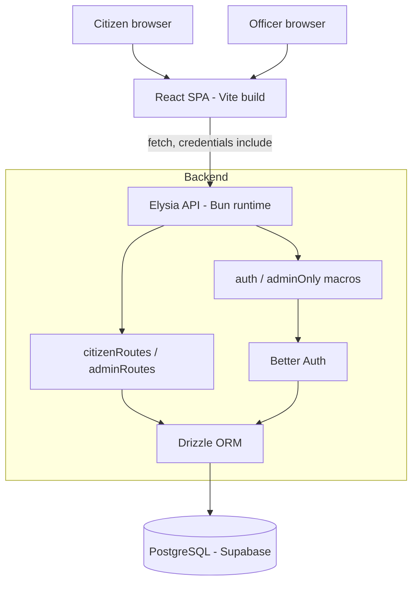
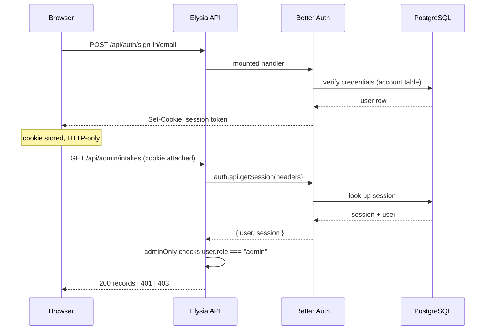

# Architecture

## Overview

ZivaID is a two-tier client–server application. There is no server-side
rendering, no BFF layer, and no message queue — a React single-page application
talks directly to an Elysia HTTP API, which owns all database access.



Both authentication state and application data live in the same PostgreSQL
database, reached through a single Drizzle connection. Better Auth is not a
separate service; it is a plugin mounted into the same Elysia app.

## Frontend–backend communication

The SPA calls the API with the `fetch` API. Every authenticated call sets
`credentials: 'include'` so the browser attaches the session cookie:

```js
// API_BASE already contains the /api segment, so call sites append only the resource.
const res = await fetch(`${API_BASE}/admin/intakes`, {
  credentials: 'include',
});
```

`API_BASE` is defined once, in `client/src/utils/records.js`, and imported
everywhere else:

```js
const AUTH_ORIGIN = import.meta.env.VITE_BETTER_AUTH_URL || 'http://localhost:3000';
export const API_BASE =
  import.meta.env.VITE_API_URL || (import.meta.env.PROD ? '/api' : `${AUTH_ORIGIN}/api`);
```

In production it resolves to the **relative** `/api`, which keeps the frontend
and API same-origin — so the session cookie is first-party and no cross-site
cookie configuration is needed. In development it points at
`http://localhost:3000/api`. `VITE_API_URL` overrides both for deployments that
split the two origins.

Note this is **not** the Better Auth base URL. The auth client uses
`VITE_BETTER_AUTH_URL` and appends `/api/auth` itself.

Better Auth calls (sign-up, sign-in, sign-out, session) do not use `fetch`
directly. They go through the typed client in `client/src/lib/auth-client.ts`,
which manages credentials itself.

## Authentication flow



Better Auth is mounted with `.mount(auth.handler)` at the application root.
Because Better Auth's own default `basePath` is `/api/auth`, the auth endpoints
land at `/api/auth/*` without any explicit prefix. This is verified behaviour:
`GET /api/auth/ok` returns `200`.

### Route guards

Two macros are declared on the `betterAuthPlugin` in `app/src/app.ts`:

| Macro | Behaviour |
|---|---|
| `auth: true` | Resolves the session; returns `401` if absent. Injects `user` and `session` into the handler context. |
| `adminOnly: true` | Same, plus returns `403 { error: "Admin access required" }` unless `user.role === "admin"` |

Both run as `resolve` functions, so they execute before the handler and the
handler can rely on `user` being present.

**Registration order matters.** `betterAuthPlugin` must be registered before
`citizenRoutes` and `adminRoutes`, or the macros will not exist when those
routes are defined.

## Role-based access

Role lives on the `user` table, defaults to `citizen`, and is declared with
`input: false` in the Better Auth config — so it cannot be supplied during
sign-up. A user cannot make themselves an administrator; only
`PATCH /api/admin/users/:id/role` can, and that route is itself `adminOnly`.

This creates a bootstrapping constraint: **the first administrator must be
promoted directly in the database**, because no admin exists to promote them.

Authorisation is enforced in two independent places:

1. **Server** — the `adminOnly` macro. This is the real boundary.
2. **Client** — `ProtectedRoute` with a `requireRole` prop, which redirects
   unauthorised users. This is a convenience, not a security control; it only
   hides UI.

Citizen data isolation is enforced in the query itself rather than by a guard.
`GET /api/citizen/intake/:id` filters on both the record ID and the caller's
`user.id`, so requesting another citizen's record returns `404` rather than
leaking its existence.

## Database interaction

`app/src/db/index.ts` creates one `postgres.js` client at module scope and wraps
it with Drizzle:

```ts
const client = postgres(env.DATABASE_URL, { prepare: false });
export const db = drizzle({ client, schema });
```

Two deliberate choices:

- **Module-level singleton** — the connection pool is created once per process
  and reused, rather than per request.
- **`prepare: false`** — disables prepared statements, which is required for
  transaction-mode connection poolers such as Supabase's pgBouncer. Without it,
  pooled connections fail with prepared-statement errors.

All queries go through Drizzle; there is no raw SQL in the application code.

## Configuration

`app/src/lib/env.ts` is the single source of truth for configuration. It reads
and validates every variable at import time and throws on the first bad value,
so a misconfigured deployment fails immediately with a readable message instead
of surfacing later as a confusing CORS or auth error.

Validated at startup:

- `DATABASE_URL`, `BETTER_AUTH_SECRET`, `BETTER_AUTH_URL` are required
- `BETTER_AUTH_SECRET` must be at least 32 characters
- Origins must be absolute URLs, and must be `https://` when `NODE_ENV=production`
- `PORT` must be an integer between 1 and 65535

## Important design decisions

| Decision | Rationale | Trade-off |
|---|---|---|
| Better Auth mounted into Elysia rather than run separately | One process, one database connection, one deployment | Auth path is fixed at `/api/auth`; domain routes were prefixed `/api/*` to match |
| App built in `app.ts`, listener only in `index.ts` | One app instance serves both the local server and the serverless export, so middleware order cannot drift | An extra indirection when reading the entry point |
| Every route under `/api/*` | Lets the SPA and API share one origin, making the session cookie first-party | Auth routes sit at `/api/auth`, fixed by Better Auth, so the prefix had to match it rather than the reverse |
| Reference number separate from primary key | Citizens need a shareable identifier that leaks no row count | Two identifiers to keep straight; admin routes use one, citizen routes the other |
| `status_logs` append-only | Audit integrity — history cannot be rewritten by a status update | Table grows without bound; no archival strategy |
| Checklist stored as rows, not JSON | Queryable per item; supports future per-item officer verification | More rows per record |
| `details` stored as a JSON string in a `text` column | Document types need different fields without schema churn | Not queryable in SQL; parsed in the route handler |
| Frontend in JavaScript, backend in TypeScript | Backend benefits most from type safety, given schema and validation | No shared types across the boundary; enums are duplicated in `utils/records.js` |
| Validation via Elysia `t` schemas | Runtime validation and static types from one definition | Validation lives in route files rather than a shared module |

## Current architectural limitations

1. **No root `package.json`.** The frontend and backend are independent projects
   with no workspace root, so there is no single install or build command
   locally. Vercel handles this with an explicit `installCommand`.
2. **Status transitions are unvalidated.** The API accepts any of the five
   statuses from any current state.
4. **Enum values are duplicated** between `app/src/db/schema.ts`,
   `app/src/routes/admin.ts`, and `client/src/utils/records.js`. A change must
   be made in three places.
5. **No shared types** between client and server.
6. **Assisted intake has no endpoint.** The officer UI exists but submitting
   only raises a browser alert.
7. **`details` is opaque to the database.** Reporting on document-specific
   fields would require application-side parsing.
8. **Single JS bundle.** No route-level code splitting, so the whole application
   downloads on first paint.
