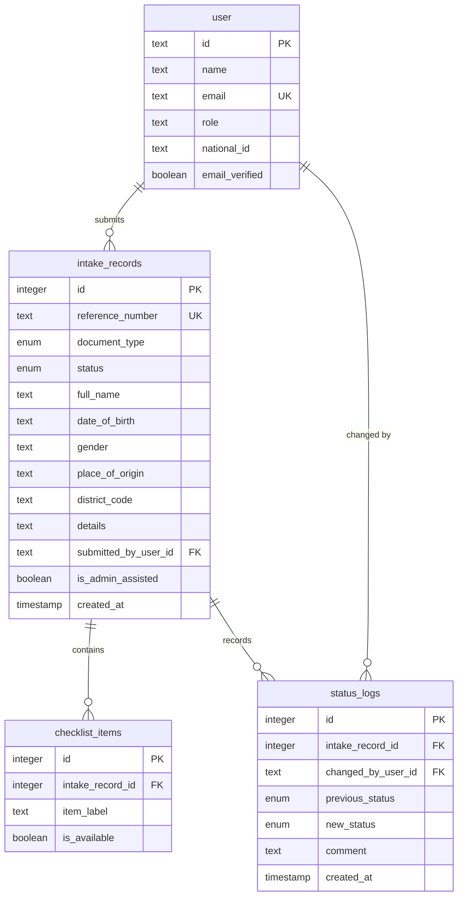

# Database

## Overview

ZivaID uses a single PostgreSQL database hosted on Supabase, accessed through
Drizzle ORM with the `postgres.js` driver. Both authentication state and
application data live in the same database.

| Item | Value |
|---|---|
| Engine | PostgreSQL |
| Host | Supabase |
| ORM | Drizzle ORM `^0.45.2` |
| Migration tool | Drizzle Kit `^0.31.10` |
| Driver | `postgres.js` `^3.4.9` |
| Schema definition | `app/src/db/schema.ts` |
| Connection | `app/src/db/index.ts` |
| Migrations | `app/drizzle/` |

The connection is created once at module scope with `prepare: false`, which is
required for transaction-mode poolers such as Supabase's pgBouncer.

## Enums

### `document_type`

| Value | Meaning |
|---|---|
| `national_id` | National ID card |
| `birth_certificate` | Birth certificate |

### `status`

| Value | Meaning |
|---|---|
| `submitted` | Received, not yet reviewed |
| `under_review` | An officer is assessing the record |
| `missing_information` | Something is required before proceeding |
| `ready_for_registry_visit` | Preparation complete |
| `closed` | Finalised |

These are the **only** values accepted by
`PATCH /api/admin/intakes/:referenceNumber/status`. The route's validation union
matches the database enum exactly.

> ⚠️ These values are duplicated in three places: `app/src/db/schema.ts`,
> `app/src/routes/admin.ts`, and `client/src/utils/records.js`. Changing the
> lifecycle means editing all three.

## Tables

### Authentication tables (Better Auth)

| Table | Purpose |
|---|---|
| `user` | Accounts. ZivaID adds `role` (default `citizen`) and optional `national_id` |
| `session` | Active sessions with expiry, IP, and user agent |
| `account` | Credentials, including the password hash |
| `verification` | Verification tokens (present but unused — email verification is not enabled) |

Password hashes and session tokens are managed entirely by Better Auth and are
not read or written by application code.

### `intake_records`

The central domain table — one row per submitted intake record.

| Column | Type | Notes |
|---|---|---|
| `id` | integer, identity | Internal primary key |
| `reference_number` | text, unique | Public identifier, `ZID-*` |
| `document_type` | enum | |
| `status` | enum | Defaults to `submitted` |
| `full_name` | text | |
| `date_of_birth` | text | Stored as text, not `date` |
| `gender` | text | |
| `place_of_origin` | text | |
| `district_code` | text, nullable | Two-digit registry code; added in migration `0001` |
| `details` | text, nullable | Document-specific fields as a JSON string |
| `submitted_by_user_id` | text, FK → `user.id` | Cascade delete |
| `is_admin_assisted` | boolean | Defaults to `false` |
| `created_at` / `updated_at` | timestamp | |

Indexed on `submitted_by_user_id`.

### `checklist_items`

One row per supporting document the citizen declared.

| Column | Type | Notes |
|---|---|---|
| `id` | integer, identity | |
| `intake_record_id` | integer, FK | Cascade delete |
| `item_label` | text | **Stored in English** — see below |
| `is_available` | boolean | Defaults to `false` |

> `item_label` is submitted by the client and stored verbatim. The frontend
> deliberately sends the **English** string even though the UI displays
> multilingual labels, so record data stays in one language. See
> [MULTILINGUAL_LABELS.md](MULTILINGUAL_LABELS.md).

### `status_logs`

Append-only audit trail. Rows are inserted, never updated or deleted.

| Column | Type | Notes |
|---|---|---|
| `id` | integer, identity | |
| `intake_record_id` | integer, FK | Cascade delete |
| `changed_by_user_id` | text, FK → `user.id` | No cascade — officers are not deletable while logs reference them |
| `previous_status` | enum, nullable | `null` on the initial submission entry |
| `new_status` | enum | |
| `comment` | text, nullable | Officer guidance |
| `created_at` | timestamp | |

The first entry for every record is written at submission time with
`previous_status: null`, `new_status: "submitted"`, and the comment
`"Initial submission"`.

## Relationships

- A `user` submits many `intake_records`
- An `intake_record` has many `checklist_items`
- An `intake_record` has many `status_logs`
- A `status_log` references the officer who made the change



Deleting a user cascades to their intake records, and deleting an intake record
cascades to its checklist items and status logs. `status_logs.changed_by_user_id`
does **not** cascade, which protects audit integrity.

## Reference number vs. database ID

| | `id` | `reference_number` |
|---|---|---|
| Type | integer | text |
| Audience | Internal | Public |
| Example | `7` | `ZID-BC-2026-482913` |
| Used by | Citizen single-record route, foreign keys | All admin routes |

Format: `ZID-{BC|NID}-{YEAR}-{6 digits}`. Generation loops until the candidate
is unique, so collisions cannot produce duplicates.

Using the reference number on admin routes means an officer never handles the
internal key, and the identifier reveals nothing about how many records exist.

## Migrations

```bash
cd app

bun run db:generate   # diff schema.ts against the last snapshot, emit SQL
bun run db:migrate    # apply pending migrations
bun run db:push       # push schema directly — development only
```

**Recommended workflow:** edit `src/db/schema.ts` → `db:generate` → review the
SQL in `drizzle/` → `db:migrate`. Generated migrations are reviewable and
reproducible; `db:push` is not.

### Applied migrations

| File | Change |
|---|---|
| `0000_wise_captain_america.sql` | Initial schema — 7 tables, 2 enums, indexes, foreign keys |
| `0001_simple_junta.sql` | `ALTER TABLE "intake_records" ADD COLUMN "district_code" text;` |

### Baselining note

The schema was originally created with `db:push`, which applies DDL without
recording anything in `drizzle.__drizzle_migrations`. That left the database in
a state where `db:migrate` would try to replay `0000` and fail with
*"relation already exists"*.

This was resolved by **baselining**: creating the `drizzle` schema and
`__drizzle_migrations` table, then inserting a row for `0000` marking it as
already applied — without executing its SQL. `db:migrate` then applied `0001`
normally.

The database now has two migration rows and behaves like any normally-migrated
project. **This is a one-time fix and does not need repeating.** A fresh
database should simply run `db:migrate` from empty.

### Reversing `0001`

```sql
ALTER TABLE "intake_records" DROP COLUMN "district_code";
```

Drizzle Kit does not generate down-migrations; reversals must be written by hand.

## Inspecting the database

There is no bundled admin UI. Options:

- **Supabase dashboard** — table editor and SQL editor
- **Drizzle Studio** — `bunx drizzle-kit studio` from `app/` (not in `package.json`)
- **`psql`** — using `DATABASE_URL`

## Seeding

There is **no seed script**. To create the first administrator:

1. Register a normal citizen account through the UI
2. Promote it directly in the database:

```sql
UPDATE "user" SET role = 'admin' WHERE email = 'your-email@example.com';
```

Subsequent administrators can be promoted through
`PATCH /api/admin/users/:id/role`. The first one cannot, because that route requires
an existing admin.

## Data-handling considerations

- Names, dates of birth, and National ID numbers are stored **in plain text**
- There is no encryption at rest beyond what Supabase provides
- There is no retention or deletion policy
- `status_logs` grows without bound and has no archival strategy
- Test runs write real rows — `app/tests/auth.test.ts` creates a user per run

> This is an academic prototype. Do not store real citizen data in it.
