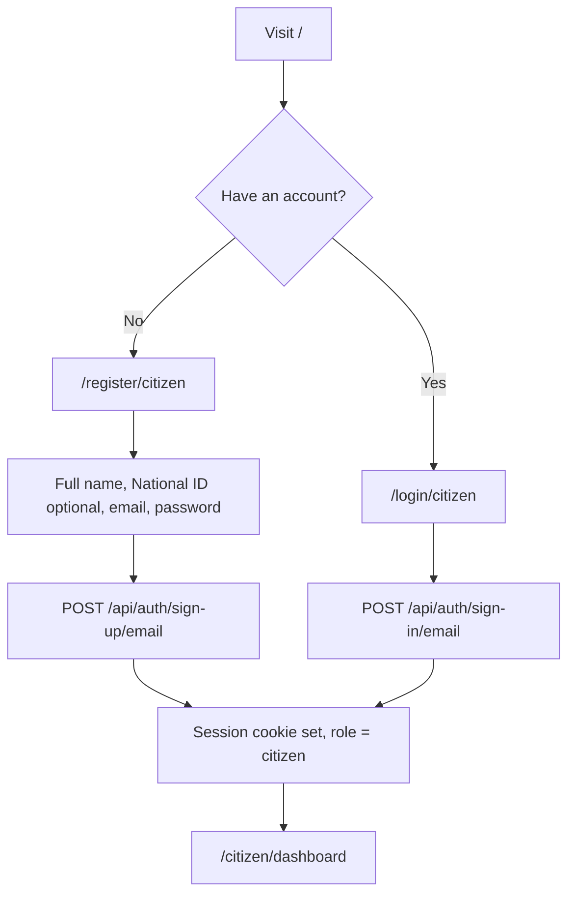
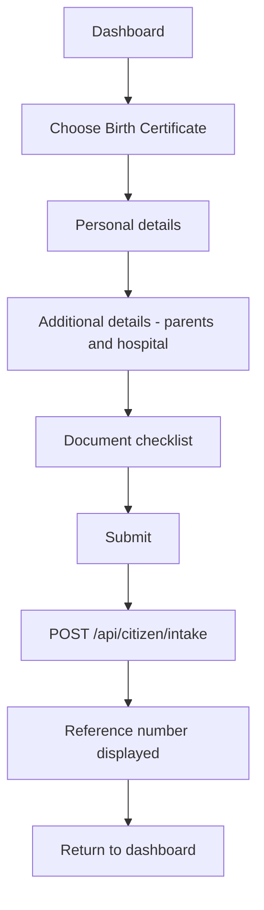
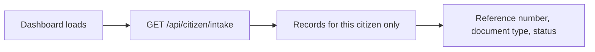
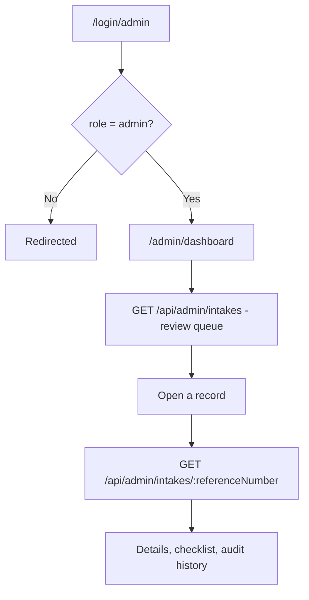
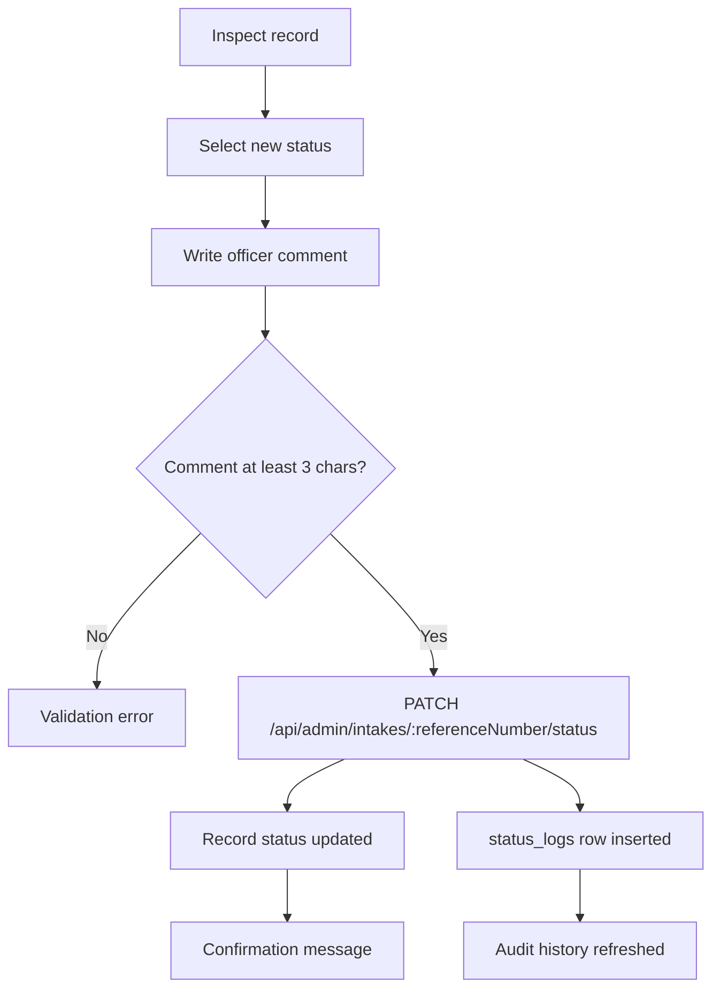
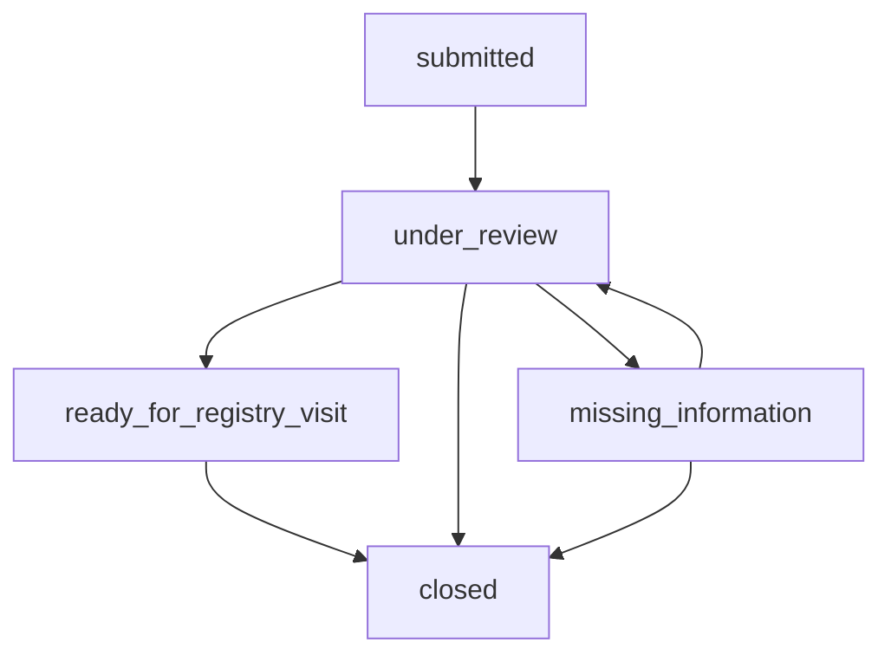

# User Flows

Every route and screen below was verified against `client/src/App.jsx` and the
Elysia route definitions. Flows for features that are not yet complete are
marked accordingly.

## Route map

| Route | Screen | Access |
|---|---|---|
| `/` | Auth gateway (landing) | Public |
| `/register/citizen` | Citizen registration | Public |
| `/login/citizen` | Citizen login | Public |
| `/login/admin` | Officer login | Public |
| `/citizen/dashboard` | Citizen dashboard | Citizen session |
| `/citizen/apply/:docType` | Intake form (`birth` or `id`) | Citizen session |
| `/admin/dashboard` | Officer portal | Admin role |
| `/admin/review/:recordId` | Record inspection | Admin role |

`/citizen/*` redirects to the dashboard; any unmatched route redirects to `/`.

Note that `:docType` uses the short values `birth` and `id` in the URL, which
map internally to `birth_certificate` and `national_id`.

---

## 1. Citizen registration and login

**Steps**

1. Open `/` and choose citizen registration or login.
2. Registration collects full legal name, an optional existing National ID
   number, email, and password. All labels appear in English, Shona, and Ndebele.
3. Better Auth creates the account with role `citizen`. Role cannot be supplied
   by the client.
4. On success the browser receives an HTTP-only session cookie and is redirected
   to the dashboard.
5. Failures show an inline error; the form is not cleared.

---

## 2. Birth certificate intake

**Route:** `/citizen/apply/birth`

**Fields collected**

| Section | Fields |
|---|---|
| Personal details | Full name, date of birth, gender, district of registration (62 options), place of origin |
| Additional details | Mother's full name*, mother's maiden name*, mother's National ID*, father's full name, father's National ID, hospital or clinic of birth* |
| Checklist | Notification of Birth, mother's ID, father's ID, marriage certificate |

*Required.

The checklist records what the citizen **says** they have. Nothing is uploaded
and nothing is verified at this stage.

On success the screen shows the generated reference number — for example
`ZID-BC-2026-482913` — with a prompt to keep it safe.

---

## 3. National ID intake

**Route:** `/citizen/apply/id`

Same structure as the birth certificate flow, with different fields and one
additional rule.

| Section | Fields |
|---|---|
| Additional details | Birth certificate entry number*, application reason*, accompanying parent/guardian name |
| Checklist | Long birth certificate, two passport photographs, parent/guardian ID, police report or affidavit, marriage certificate |

**Age eligibility.** Before submitting, the form checks that the applicant is at
least 16 years old, calculated from the date of birth. If not, submission is
blocked with:

> Eligibility Error: Zimbabwean citizens must be at least 16 years old to apply
> for a National ID.

This check runs **client-side only**. The API does not enforce it.

---

## 4. Status tracking

**Route:** `/citizen/dashboard`

The dashboard fetches the citizen's own records and displays each with its
current status as a colour-coded badge. Records belonging to other users are
never returned — the query filters on the authenticated user's ID.

Tracking is **pull-based**: the citizen sees the status when they open the
dashboard. There are no notifications.

---

## 5. Officer review

**Routes:** `/admin/dashboard` → `/admin/review/:recordId`

The queue lists every intake record, newest first, filterable by document type,
with counts by status. Opening a record fetches it by **reference number** and
returns the record, its checklist, and its full audit history with officer names.

The officer portal has three tabs: **Review Queue** (working), **Assisted
Citizen Intake** (see §7), and **Audit** (a placeholder — per-record audit
history is on the review screen instead).

---

## 6. Status update and audit logging

**Route:** `/admin/review/:recordId`

**Steps**

1. Choose one of the five statuses.
2. Write a comment — **mandatory**, minimum three characters. A status cannot
   change without a recorded reason.
3. Save. The API updates the record and inserts a `status_logs` row capturing
   previous status, new status, officer ID, and comment.
4. The audit history updates, newest first.

Records are updated in place, but their history is append-only and cannot be
rewritten.

> **Limitation:** transitions are not validated. Any status may follow any
> other, so a record can move directly from `submitted` to `closed`.

---

## 7. Assisted citizen intake — *In progress*

**Route:** `/admin/dashboard` → Assisted Citizen Intake tab

Intended for citizens who cannot use the system themselves, including those with
limited digital literacy or no email account. An officer captures their
information with consent, and the record is flagged `isAdminAssisted`.

**Current state:** the form exists and collects full legal name, document
service type, date of birth, district/province, residential address, and officer
notes. Its labels are multilingual and every field is properly associated with
its label.

However, **submitting does not save anything.** There is no server endpoint for
assisted intake, and the handler raises:

> Assisted intake is not yet connected to the registry database.

The `is_admin_assisted` column and the dashboard's "Assisted Intakes" counter
exist and are ready for it. What remains is a server endpoint and wiring the
form to real state.

---

## Status lifecycle

This is the **expected** progression, not an enforced one. See
[API.md](API.md) for the status-update contract.
